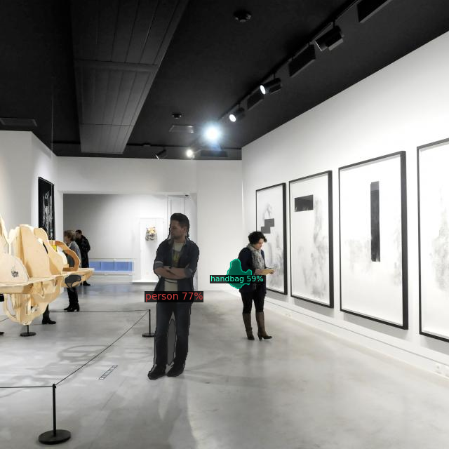

# SparseInst_TensorRT
 This repository implement the real-time Instance Segmentation Algorithm named SparseInst with TensoRT and ONNX.
 
 
 

 
 Some remarks : 
  - The initial repository has been clone from hustvl/SparseInst (https://github.com/hustvl/SparseInst.git), for additional information about the installation of SparseInst, refer to the original repository. 
  - This project is built upon the excellent framework detectron2, and you should install detectron2 first, please check official installation guide for more details.
  - For command other than TensoRT and ONNX inference, please refer to the initial repository (e.g eval.py). 
 
 Be aware that in order to parse the model to ONNX and TensorRT, the files sparseinst.py, encoder.py and decoder.py has been modified/slightly modified, don't forget to check the modifications if you come from the initial repository.
 For now, the code only works with one input image of size 640x640. Further implementations will be added such as multiple images and videos and different input sizes.
 
 
 Prerequisite : Please download the weights pytorch file from hustvl/SparseInst :  'weights/sparse_inst_r50_giam_aug_2b7d68.pth'.
 
 **Build the ONNX model  :**
 ```
 <sudo python3 convert_onnx.py --config-file config-gile --output output_directory_onnxmodel --image dummy_input --opts MODEL.WEIGHTS weights_directory>
 ```
 
  **Build the TensorRT model  :**
 ```
 <sudo python3 build_engine.py --onnx_model onnx-model-directory --output output_directory_TensoRTModel
 ```
 
  **Infer both TensorRT and ONNX model :**
 ```
 <sudo python3 test_infer_img_trt.py --config-file config_file_directory --onnx_engine onnx-model-directory --tensorRT_engine tensorRT-model-directory --input input_image_directory 
 ```
 
 
 
 
 
 
 
 


 
